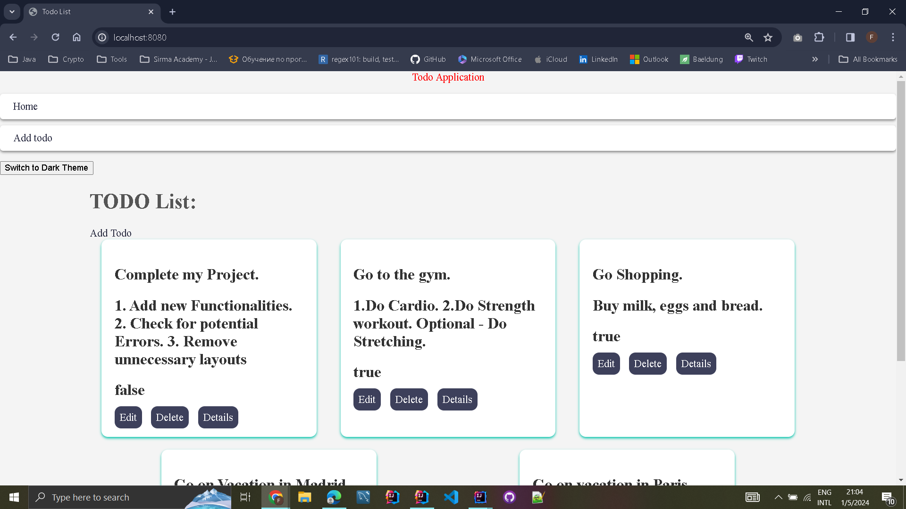

#  Todo Manager Application

## Project Overview

The Todo Application is a web-based task management system developed using the Spring Boot framework. It provides users with the ability to seamlessly organize their tasks through functionalities such as adding new todos, editing existing ones, and deleting tasks they have completed. The application employs a modern and user-friendly interface crafted with HTML and CSS, while Thymeleaf serves as the server-side templating engine.

## Home Page View

## Features

1. **Add New Todos:** Users can add new tasks to the TODO list, specifying the task details.

2. **Delete Todos:** Tasks that are no longer needed can be deleted from the TODO list.

3. **Edit Todos:** Users can update task details, such as the task description or title.

4. **Dark Mode Theme:** The application offers a "Switch to Dark Mode" theme option for a personalized and comfortable user experience.

5. **Data Validation**: Ensures accurate and reliable data entry using Jakarta Validation constraints.

6. **Persistence**: Leverages MySQL and JPA Repository for reliable data storage and retrieval.
## Technologies Used

- Spring Boot
- Maven
- MySQL Server
- JPA Repository
- Thymeleaf
- HTML/CSS
- Jakarta Validation Constraints

## Getting Started

### Prerequisites

- Java JDK 11 or later
- Maven
- MySQL Server

### Setup and Installation

1. **Clone the Repository**:
2. **Navigate to the Project Directory**:
3. **Configure MySQL Database**:
- Create a new MySQL database named `todo_db`.
- Update `application.properties` with your database username and password.

4. **Build the Project with Maven**:
5. **Run the Application**:
   The application will start and be accessible at `http://localhost:8080`.

### Using the Application

- **Add a Task**: Go to the 'Add Task' page to create a new task.
- **Edit a Task**: Click on the 'Edit' button next to any task to modify its details.
- **Delete a Task**: Remove a task from your list by clicking the 'Delete' button.
- **Enable Dark Mode**: Opt for the dark theme for a comfortable viewing experience in different lighting conditions.

## Author
 **Mohamed Karaahmed**
